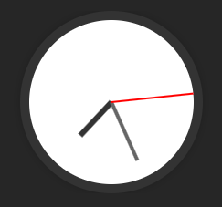
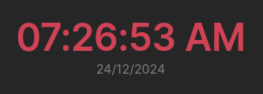
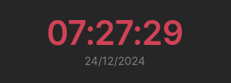
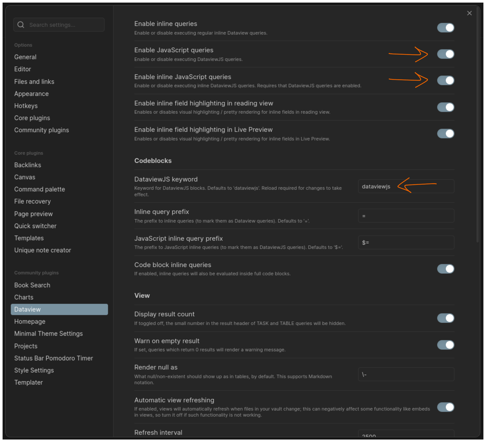
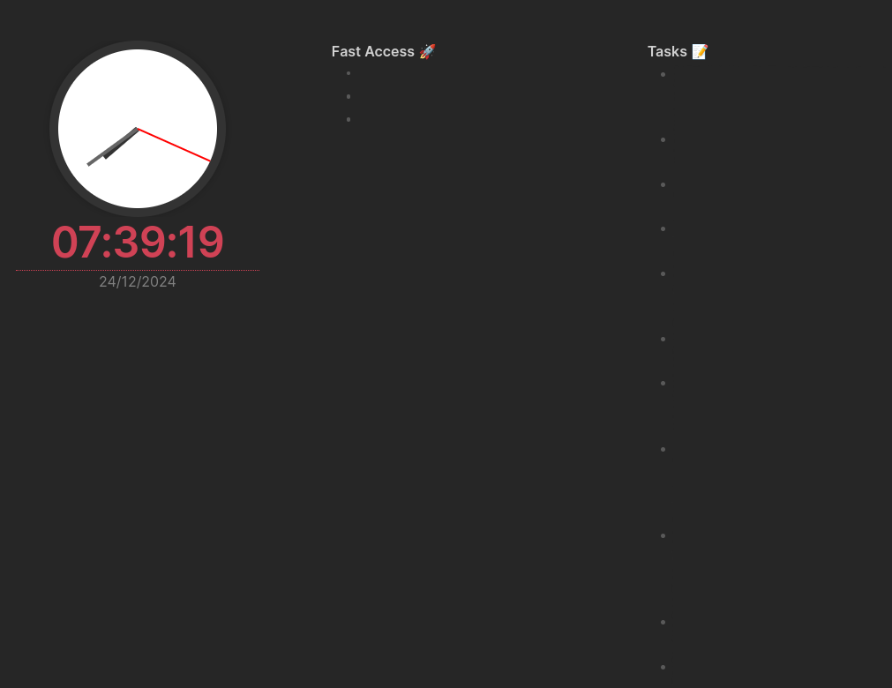

This repository contains templates for displaying an active clock within your notes, which works seamlessly in both editing and reading modes. The only required plugin is the [Obsidian Dataview Plugin](https://blacksmithgu.github.io/obsidian-dataview/).

Here are the outputs of each template:

- 
- 
- 

Ensure that the necessary options are enabled, and check that the `dataviewJS` keyword is used. If not, you may need to modify the templates accordingly to ensure they function correctly.

- 

These templates are inline `dataviewJS` queries, making them work perfectly with the [Dashboard++](https://tfthacker.com/article-obsidian-dashboardplusplus2022) CSS snippet, as shown below:

- 